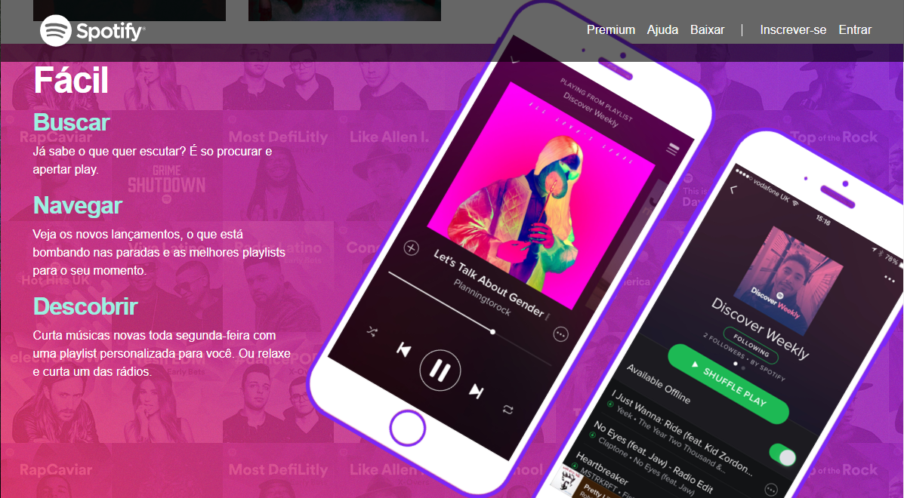

# Projeto Spotify Clone
#### Desenvolvido como forma de aprendizado no curso : [Desenvolvimento Web Completo 2020](https://www.udemy.com/course/web-completo/)

### Bootstrap para recurso responsivo
### HTML5 e CSS3

